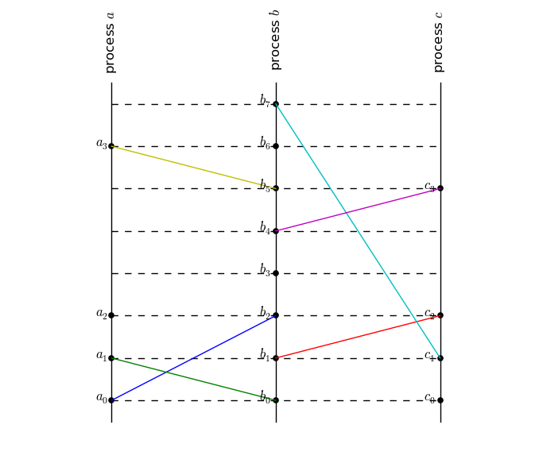
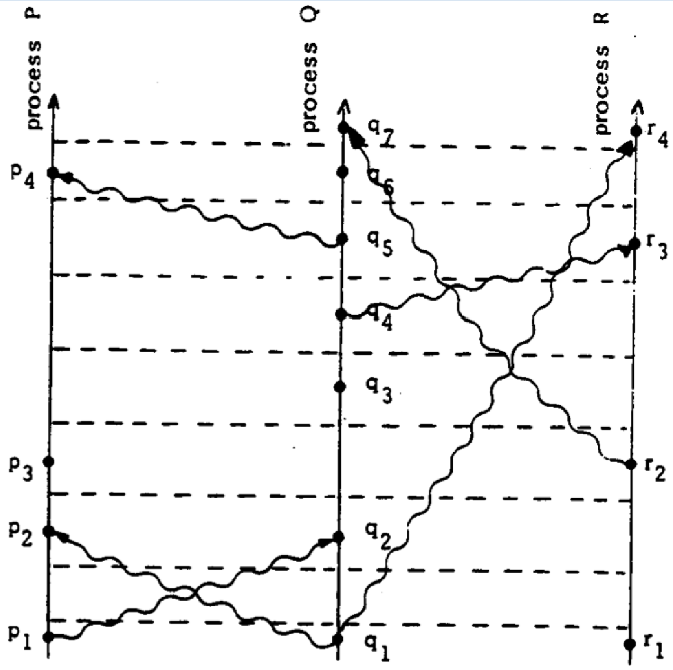

# Clocks #
An implementation of [Lamport timestamps][lamport]. I also wrote [a blog
post](http://mwhittaker.github.io/2015/01/20/logical-clocks/) about this
implementation.

| `python main.py`   | Lamport's paper     |
| ------------------ | ------------------- |
|  |  |

[lamport]: http://web.stanford.edu/class/cs240/readings/lamport.pdf
